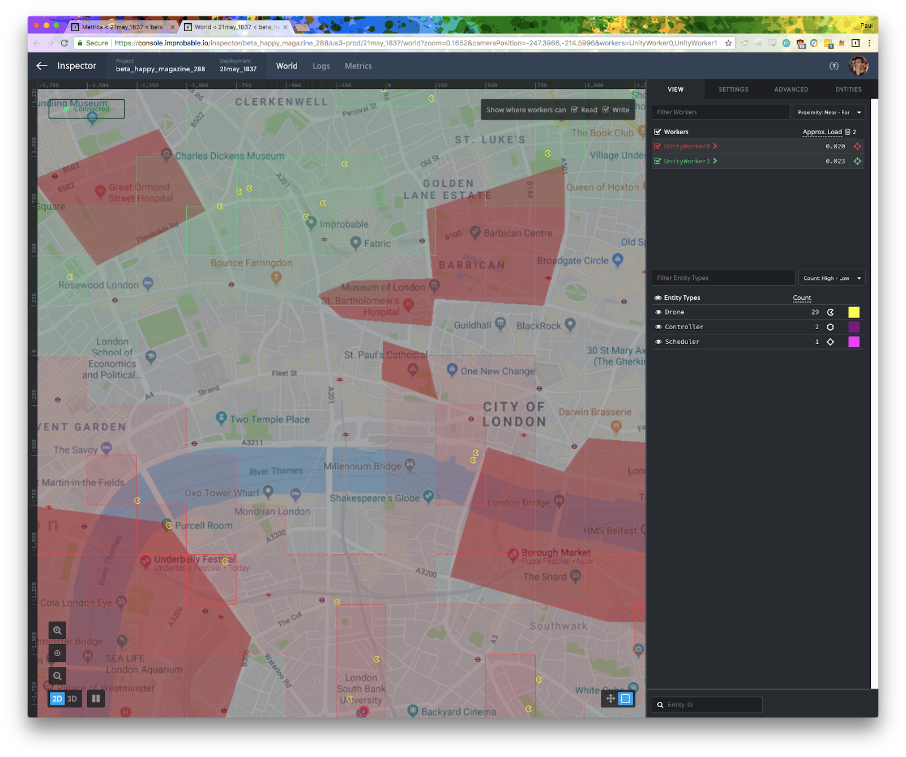

> [Click here for publication](https://dl.acm.org/doi/10.1145/3306309.3306339).

# Simulating Drone Delivery Networks using SpatialOS

Here's the repository containing all the work I did for my Masters project at Imperial. 

> Note that I used the old SpatialOS *SDK* for Unity, and not the latest [*GDK* for Unity](https://improbable.io/games/blog/spatialos-gdk-for-unity-launch).

Useful links:
* [Codebase](codebase)
* [Raw Results](codebase/analysis)
* [Interim Report](InterimReport.pdf)
* [Final Report](FinalReport.pdf)
* [Final Presentation](prezzie.pdf)
* [Paper published at Valuetools 2019](https://dl.acm.org/doi/10.1145/3306309.3306339)

Have fun browsing!
